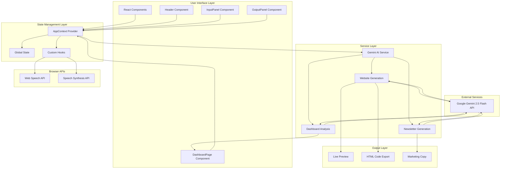

# Digital Ally - Comprehensive Project Analysis & Future Roadmap

## 1. Project Overview & Current State

### Executive Summary

**Digital Ally** (formerly BizBoost) is an advanced AI-powered platform designed to bridge the gap between business ideas and digital presence. The platform enables non-technical business owners to instantly generate professional websites, business newsletters, and analytical dashboards through natural language input and voice interaction.

**Core Problem Solved:** Traditional website development requires technical expertise, significant time investment, and financial resources. Digital Ally democratizes web development by leveraging Google's Gemini 2.5 Flash AI model to transform simple text descriptions into fully responsive, production-ready websites in seconds.

**Current Capabilities:**
- **AI Website Generation:** Converts business descriptions into complete, responsive HTML5 websites with Tailwind CSS styling
- **Voice Interaction:** Speech-to-text for input dictation and text-to-speech for content consumption
- **Multi-Language Support:** Interface and output support for English, Telugu (తెలుగు), and Hindi (हिन्दी)
- **Dynamic Content Creation:** Automated marketing copy and newsletter generation
- **Smart Customization:** AI-assisted modifications through natural language prompts
- **Real-time Preview:** Live website preview with code export functionality
- **Analytics Dashboard:** Mock business intelligence dashboard with AI-powered insights
- **Color Palette System:** Pre-designed professional color schemes (Modern, Vibrant, Corporate, Elegant)

### Core Tech Stack

**Frontend Framework & Build Tools:**
- **React 19.1.1** - Latest React with concurrent features and improved performance
- **TypeScript 5.8.2** - Type-safe development with strict configuration
- **Vite 6.2.0** - Lightning-fast build tool with HMR and optimized production builds
- **React Router DOM 6.30.3** - Client-side routing for multi-page application feel

**AI & Machine Learning:**
- **Google Gemini 2.5 Flash** - State-of-the-art generative AI model via `@google/genai` SDK (v1.12.0)
- **Temperature Configuration:** 0.7 for website generation, 0.8 for newsletters, 0.5 for analysis
- **Top-P Sampling:** 0.95 for diverse yet coherent outputs

**Styling & UI:**
- **Tailwind CSS** - Utility-first CSS framework (loaded via CDN for generated websites)
- **Inline Styling** - React inline styles for the application interface
- **Responsive Design** - Mobile-first approach with breakpoint-aware layouts

**Browser APIs:**
- **Web Speech API** - SpeechRecognition for speech-to-text
- **Speech Synthesis API** - Text-to-speech for multilingual audio output

**Development Environment:**
- **Node.js** - JavaScript runtime
- **ES2022** - Modern JavaScript features
- **Module System:** ES Modules with bundler resolution

---

## 2. Comprehensive System Architecture

### System Architecture Diagram



### Data Flow & Module Interactions

**1. User Input Flow:**
```
User Input (Text/Voice) → InputPanel → AppContext State → Validation → Gemini Service → AI Processing → Generated HTML → OutputPanel → Preview/Export
```

**2. State Management Flow:**
```
AppContext Provider → Global State (userName, businessName, prompt, etc.) → Component Consumers → State Updates → Re-render → UI Updates
```

**3. AI Integration Flow:**
```
User Prompt → Prompt Template Construction → Gemini API Call → Response Cleaning → HTML Validation → State Update → Preview Generation
```

**4. Voice Interaction Flow:**
```
Microphone Input → Web Speech API → Speech Recognition → Transcript → Text Area → User Confirmation → Processing
Text Output → Speech Synthesis API → Voice Selection → Audio Playback → User Listening
```

**5. Modification Flow:**
```
Modification Request → Modification Prompt State → handleAssist() → Gemini API with Context → Modified HTML → Preview Update
```

### Core Module Responsibilities

**AppContext (`src/context/AppContext.tsx`)**
- Centralized state management for entire application
- Handles form data, generation state, error handling
- Manages retry logic with maximum 3 attempts
- Provides translation function `t()` for i18n
- Coordinates between components and services

**Gemini Service (`src/services/geminiService.ts`)**
- Abstracts Google Gemini API interactions
- Implements three main functions:
  - `generateWebsite()` - Creates HTML websites
  - `generateNewsletter()` - Generates marketing copy
  - `analyzeAndTranslateDashboard()` - Analyzes dashboard data
- Response cleaning to remove markdown code blocks
- Error handling with specific error messages

**Custom Hooks:**
- `useSpeechToText` - Manages speech recognition with browser API
- `useTextToSpeech` - Handles text-to-speech with voice selection

**Components:**
- `InputPanel` - Multi-step form with progressive disclosure
- `OutputPanel` - Preview/code view with modification capabilities
- `Header` - Navigation, language selection, example prompts
- `LoadingSpinner` - Visual loading indicator
- `ErrorBoundary` - React error boundary for graceful error handling

**Pages:**
- `HomePage` - Entry point with InputPanel
- `ResultPage` - Displays generated website
- `DashboardPage` - Business analytics dashboard

---

## 3. Complete Directory & File Structure

```
Digital-Ally/
├── .env                                    # Environment variables (Gemini API Key)
├── .git/                                   # Git version control
├── .gitignore                              # Git ignore rules
├── index.css                               # Global CSS styles
├── index.html                              # HTML entry point
├── index.tsx                               # React application entry point
├── metadata.json                           # Project metadata
├── package-lock.json                       # Dependency lock file
├── package.json                            # Project dependencies and scripts
├── README.md                               # Project documentation
├── tsconfig.json                           # TypeScript configuration
├── vite.config.ts                          # Vite build configuration
│
└── src/                                    # Source code directory
    ├── App.tsx                             # Main application component (legacy)
    ├── components/                         # Reusable UI components
    │   ├── ErrorBoundary.tsx              # Error boundary component
    │   ├── Header.tsx                      # Navigation header
    │   ├── InputPanel.tsx                  # Multi-step input form
    │   ├── LoadingSpinner.tsx              # Loading indicator
    │   ├── OutputPanel.tsx                 # Preview and code display
    │   └── icons.tsx                       # SVG icon components
    │
    ├── context/                            # React Context providers
    │   └── AppContext.tsx                  # Global state management
    │
    ├── hooks/                              # Custom React hooks
    │   ├── useSpeechToText.ts              # Speech recognition hook
    │   └── useTextToSpeech.ts              # Text-to-speech hook
    │
    ├── pages/                              # Page-level components
    │   ├── DashboardPage.tsx               # Analytics dashboard
    │   ├── HomePage.tsx                    # Home page with input form
    │   └── ResultPage.tsx                  # Result display page
    │
    ├── services/                           # API and business logic
    │   └── geminiService.ts                # Google Gemini API integration
    │
    ├── constants.ts                        # Application constants
    │                                       # (languages, color palettes, translations, prompts)
    └── types.ts                            # TypeScript type definitions
```

### Directory/File Descriptions

**Root Configuration Files:**
- `.env` - Stores sensitive environment variables (currently contains Gemini API key)
- `package.json` - Defines project metadata, dependencies, and npm scripts
- `tsconfig.json` - TypeScript compiler configuration with ES2022 target
- `vite.config.ts` - Vite build tool configuration with path aliases
- `index.html` - HTML template with root div for React mounting
- `index.tsx` - React application entry point with StrictMode

**Source Directory (`src/`):**

**`components/`** - Reusable UI components
- `ErrorBoundary.tsx` - Class component that catches React errors and displays fallback UI
- `Header.tsx` - Navigation bar with language selector, example prompts dropdown, and page navigation
- `InputPanel.tsx` - Progressive disclosure form with 4 steps: Business Details, Description, Services, and Style
- `LoadingSpinner.tsx` - SVG-based spinning loader for async operations
- `OutputPanel.tsx` - Split-view panel with live preview, code view, modification assistant, and export options
- `icons.tsx` - Collection of functional SVG icon components (Microphone, Sparkles, Check, Copy, etc.)

**`context/`** - State management
- `AppContext.tsx` - Context provider managing global state including form data, generation status, errors, language, and retry logic

**`hooks/`** - Custom React hooks
- `useSpeechToText.ts` - Wraps Web Speech API for speech-to-text with language support
- `useTextToSpeech.ts` - Wraps Speech Synthesis API for text-to-speech with voice selection

**`pages/`** - Page-level route components
- `HomePage.tsx` - Renders InputPanel for website generation
- `ResultPage.tsx` - Renders OutputPanel for displaying generated websites
- `DashboardPage.tsx` - Displays mock analytics dashboard with AI analysis feature

**`services/`** - External API integrations
- `geminiService.ts` - Google Gemini API client with three main functions for website generation, newsletter creation, and dashboard analysis

**Configuration Files:**
- `constants.ts` - Centralized constants including language definitions, color palettes, translations (English, Telugu, Hindi), example prompts, and AI prompt templates
- `types.ts` - TypeScript interfaces for AppContext, OutputView enum, and other type definitions

---

## 4. The Future Vision: Taking the Project Forward

### Phase 2 & 3 Features: Logical Next Steps

**Phase 2: Enhanced Website Generation (6-12 months)**

**Advanced Template System:**
- Industry-specific templates (Restaurant, E-commerce, Portfolio, Blog, SaaS)
- Pre-built component library (Hero sections, Testimonials, Pricing tables, Contact forms)
- Template versioning and rollback capabilities
- A/B testing framework for generated designs

**Multi-Page Website Support:**
- Generate complete multi-page websites (Home, About, Services, Contact, Blog)
- Internal linking and navigation structure
- Sitemap generation
- Page hierarchy management

**E-Commerce Integration:**
- Product catalog generation from descriptions
- Shopping cart UI components
- Payment gateway integration templates (Stripe, PayPal)
- Inventory management dashboard

**Content Management System (CMS):**
- Built-in CMS for editing generated content
- Rich text editor integration
- Media library for images and videos
- SEO optimization tools (meta tags, sitemaps, robots.txt)

**Phase 3: Platform Expansion (12-24 months)**

**Collaboration Features:**
- Team workspaces with role-based access
- Real-time collaborative editing
- Comment and approval workflows
- Version history with diff visualization

**Hosting & Deployment:**
- One-click deployment to popular platforms (Vercel, Netlify, AWS Amplify)
- Custom domain integration
- SSL certificate management
- CDN integration for global performance

**Analytics & Insights:**
- Real website analytics integration (Google Analytics, Mixpanel)
- Heatmaps and user behavior tracking
- Conversion rate optimization suggestions
- Performance monitoring and alerts

**Marketplace & Ecosystem:**
- Template marketplace for community-contributed designs
- Plugin system for third-party integrations
- API for developers to build on Digital Ally
- White-label solution for agencies

### AI & Automation Opportunities

**Generative AI Enhancements:**

**Multi-Modal AI Integration:**
- Image generation for website visuals (DALL-E, Midjourney API integration)
- Logo design generation from business descriptions
- Icon and illustration creation
- Video content generation for landing pages

**Advanced Natural Language Processing:**
- Intent recognition for better prompt understanding
- Context-aware modifications (remembers previous changes)
- Automatic content expansion based on business type
- SEO-optimized copy generation with keyword integration

**Autonomous Website Optimization:**
- AI-powered performance optimization suggestions
- Automatic A/B test generation and execution
- Conversion rate optimization through ML models
- Personalization engine for visitor segmentation

**Intelligent Assistant:**
- Conversational AI for website building (chatbot interface)
- Proactive suggestions based on industry best practices
- Competitive analysis and benchmarking
- Automated accessibility compliance (WCAG guidelines)

**Content Automation:**
- Automated blog post generation
- Social media content calendar creation
- Email marketing campaign generation
- Product description automation

### Infrastructure & Deployment Recommendations

**Containerization & Orchestration:**

**Docker Implementation:**
```dockerfile
# Multi-stage build for production
FROM node:20-alpine AS builder
WORKDIR /app
COPY package*.json ./
RUN npm ci
COPY . .
RUN npm run build

FROM nginx:alpine
COPY --from=builder /app/dist /usr/share/nginx/html
COPY nginx.conf /etc/nginx/nginx.conf
EXPOSE 80
```

**Kubernetes Deployment:**
- Horizontal Pod Autoscaling for traffic spikes
- Rolling updates for zero-downtime deployments
- ConfigMaps for environment configuration
- Secrets management for API keys

**CI/CD Pipeline (GitHub Actions):**
```yaml
name: Digital Ally CI/CD
on: [push, pull_request]
jobs:
  test:
    runs-on: ubuntu-latest
    steps:
      - uses: actions/checkout@v3
      - uses: actions/setup-node@v3
      - run: npm ci
      - run: npm test
      - run: npm run build
  deploy:
    needs: test
    runs-on: ubuntu-latest
    if: github.ref == 'refs/heads/main'
    steps:
      - uses: actions/checkout@v3
      - run: npm ci
      - run: npm run build
      - uses: aws-actions/amazon-ecs-deploy@v1
```

**Cloud-Native Architecture:**

**Microservices Migration:**
- Split monolithic React app into micro-frontends
- Separate AI service as independent API
- Content management service
- Analytics service
- User authentication service

**Serverless Implementation:**
- AWS Lambda for AI processing functions
- API Gateway for REST API endpoints
- S3 for static website hosting
- CloudFront for CDN distribution

**Database Architecture:**
- PostgreSQL for relational data (users, projects, templates)
- MongoDB for document storage (generated websites, analytics)
- Redis for caching and session management
- Elasticsearch for search functionality

**Monitoring & Observability:**
- Prometheus + Grafana for metrics
- ELK Stack (Elasticsearch, Logstash, Kibana) for logging
- Sentry for error tracking
- DataDog for APM (Application Performance Monitoring)

### Security & Performance Considerations

**Security Measures:**

**API Security:**
- Rate limiting on Gemini API calls (prevent abuse)
- API key rotation mechanism
- Request validation and sanitization
- CORS configuration for cross-origin requests

**Authentication & Authorization:**
- OAuth 2.0 integration (Google, GitHub, Microsoft)
- JWT token-based authentication
- Role-based access control (RBAC)
- Multi-factor authentication (MFA)

**Data Protection:**
- Encryption at rest (AES-256)
- Encryption in transit (TLS 1.3)
- GDPR compliance for EU users
- Data retention policies
- Regular security audits

**Input Validation:**
- XSS prevention in generated HTML
- CSRF protection for form submissions
- Content Security Policy (CSP) headers
- Input sanitization for all user inputs

**Performance Optimization:**

**Frontend Performance:**
- Code splitting with React.lazy()
- Lazy loading for images and components
- Service Worker for offline capability
- Asset optimization and minification
- Tree shaking to remove unused code

**Backend Performance:**
- Response caching for repeated prompts
- CDN for static assets
- Database query optimization
- Connection pooling for database
- Load balancing for high traffic

**AI Performance:**
- Prompt caching to reduce API calls
- Batch processing for multiple generations
- Model selection based on complexity
- Fallback to smaller models for simple tasks
- Streaming responses for faster perceived performance

**Scalability Strategy:**

**Horizontal Scaling:**
- Stateless application design
- Session storage in Redis
- Load balancer configuration
- Auto-scaling groups based on CPU/memory

**Vertical Scaling:**
- Optimized bundle sizes
- Memory-efficient algorithms
- GPU acceleration for AI processing
- Database sharding for large datasets

**Cost Optimization:**
- Reserved instances for predictable workloads
- Spot instances for batch processing
- Cost monitoring and alerts
- Right-sizing resources based on usage

**Bottleneck Anticipation & Solutions:**

**Gemini API Rate Limits:**
- Implement request queuing system
- Use exponential backoff for retries
- Cache common responses
- Implement fallback to alternative AI models

**Large File Handling:**
- Streaming for large HTML responses
- Chunked transfer encoding
- Progress indicators for users
- Timeout management

**Concurrent User Load:**
- Implement request throttling
- Use connection pooling
- Optimize database queries
- Implement read replicas

**Memory Leaks:**
- Regular memory profiling
- Proper cleanup in useEffect hooks
- Avoid memory-intensive operations in main thread
- Use Web Workers for heavy computations

### Strategic Recommendations

**Short-Term (0-6 months):**
1. Implement proper error tracking (Sentry)
2. Add comprehensive unit and integration tests
3. Implement user authentication system
4. Add project save/load functionality
5. Improve mobile responsiveness
6. Add more language support (Spanish, French, German)

**Medium-Term (6-12 months):**
1. Develop template marketplace
2. Implement multi-page website generation
3. Add e-commerce capabilities
4. Create plugin system
5. Implement real-time collaboration
6. Add advanced analytics dashboard

**Long-Term (12-24 months):**
1. Full microservices architecture
2. Global multi-region deployment
3. AI-powered autonomous optimization
4. Enterprise features (SSO, advanced permissions)
5. Mobile app development
6. White-label solution for agencies

**Success Metrics:**
- User adoption rate
- Average time to generate website
- User retention and engagement
- Generated website performance scores
- API cost per user
- Customer satisfaction (NPS)

---

## Conclusion

Digital Ally represents a innovative approach to democratizing web development through AI. The current implementation provides a solid foundation with React 19, TypeScript, and Google Gemini integration. The architecture is well-structured with clear separation of concerns between components, services, and state management.

The future roadmap presents significant opportunities for growth, from enhanced template systems and multi-page support to full platform expansion with collaboration features and marketplace capabilities. By implementing the recommended infrastructure improvements, security measures, and performance optimizations, Digital Ally can evolve from a prototype into an industry-grade platform capable of serving millions of users globally.

The key to success will be maintaining the balance between simplicity for end-users and powerful features for advanced use cases, while ensuring scalability, security, and performance as the user base grows.
